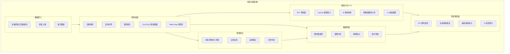
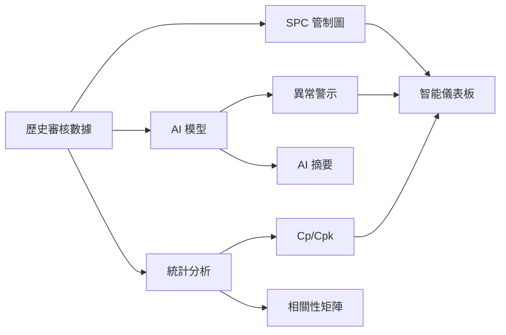
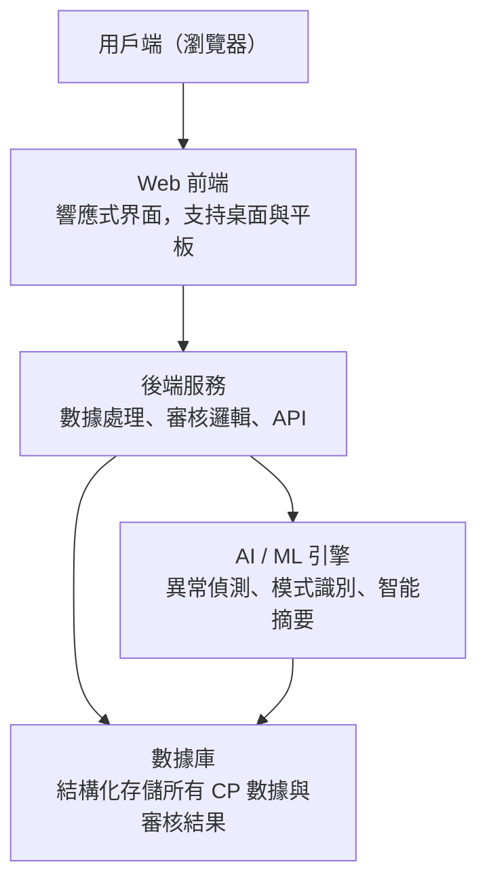
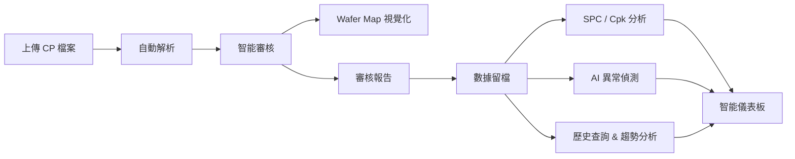

# IQC 晶圓 CP 數據審核系統 — 產品需求規格書

**版本**: v2.0
**日期**: 2026-03-12
**文件類型**: 客戶版（對外）

---

## 1. 產品概述

### 1.1 產品名稱
**IQC Wafer CP Review System**（IQC 晶圓 CP 數據智能審核平台）

### 1.2 產品定位
一套專為半導體封裝廠 IQC（來料品質檢驗）部門設計的 Web 應用系統，用於自動化處理來自不同晶圓代工廠的 CP（Chip Probing）測試數據，取代現有的人工 Excel 審核流程，實現數據的統一管理、自動審核與歷史追溯。

### 1.3 目標用戶
- IQC 品質工程師
- 品質管理主管
- 製程工程師（查詢歷史數據）

---

## 2. 背景與痛點

### 2.1 現狀
| 項目 | 現狀 | 問題 |
|------|------|------|
| 數據來源 | 不同晶圓廠提供不同格式的 CP 數據檔案 | 格式不統一，人工適配耗時 |
| 審核方式 | 使用 Excel VBA 工具手動處理 | 僅支持部分廠家，無法擴展 |
| 數據留存 | 審核完成後無系統化存檔 | 無法追溯歷史，無法分析趨勢 |
| 規格對比 | 無封裝測規與 CP 規格的交叉比對功能 | 需人工逐項比對，效率低且易出錯 |

### 2.2 核心痛點
1. **廠家覆蓋不足** — 目前僅支持 2 家晶圓廠的數據格式，其餘廠家無法自動審核
2. **純手動流程** — 每批次都需要人工操作 Excel，效率低
3. **無歷史數據庫** — 審核數據無法留檔，無法查看歷史趨勢
4. **缺乏規格對比** — 封裝端測試規格與晶圓 CP 規格無法自動比對
5. **無法批量處理** — 每次只能處理單一批次

---

## 3. 功能需求

### 3.1 功能總覽

### 3.2 模組一：數據匯入

**功能描述**: 支持上傳不同晶圓廠的 CP 數據檔案，系統自動識別格式並解析。

| 功能項 | 說明 |
|--------|------|
| 多格式支持 | 支持 .xlsx / .xls / .csv 等常見格式 |
| 自動識別 | 根據檔案結構自動識別晶圓廠家與數據格式 |
| 格式配置 | 可新增/編輯晶圓廠的數據格式模板 |
| 批量上傳 | 支持同時上傳多個批次的 CP 數據 |
| 上傳驗證 | 自動檢查數據完整性，缺失欄位即時提醒 |

### 3.3 模組二：智能審核

**功能描述**: 自動對 CP 數據進行品質審核，計算關鍵指標。

| 功能項 | 說明 |
|--------|------|
| 良率計算 | 自動計算每片 Wafer 的 Bin1 良率 |
| 電性統計 | 每個電性項目計算 Average / STDEV / Max / Min |
| 多級規格審核 | 支持 Q1 / Q2 / Q3 三組規格限制的合規性檢驗 |
| 異常標記 | 不合規項目自動高亮標記，支持設定告警閾值 |
| Wafer Map | 視覺化展示每片 Wafer 的 Die 分佈與 Bin 結果 |

### 3.4 模組三：規格對比

**功能描述**: 將封裝端測試規格與晶圓 CP 規格進行交叉比對。

| 功能項 | 說明 |
|--------|------|
| 測規管理 | 導入並管理封裝端的測試規格 |
| 項目映射 | 選擇要對比的 CP 電性項目與封裝測規項目 |
| 規則設定 | 自訂內部審核規則（如加嚴/放寬百分比） |
| 自動比對 | 系統自動執行符合性篩選 |
| 差異報告 | 生成對比結果報告，標記不符合項 |

### 3.5 模組四：數據管理

**功能描述**: 建立各廠家歷史數據庫，支持查詢與趨勢分析。

| 功能項 | 說明 |
|--------|------|
| 歷史數據庫 | 所有審核結果自動存檔，按廠家/產品/批次組織 |
| 快速查詢 | 支持按廠家、產品型號、批次號、日期等多維查詢 |
| 趨勢分析 | 關鍵電性參數的歷史趨勢圖表 |
| 報表匯出 | 支持匯出 Excel / PDF 格式的審核報告 |
| 儀表板 | 首頁展示關鍵品質指標概覽 |

### 3.6 模組五：進階分析 & AI 智能

**功能描述**: 運用統計製程管制（SPC）與 AI 演算法，提供深度品質分析與預測性異常偵測，超越傳統規格審核的被動檢查模式。

| 功能項 | 說明 |
|--------|------|
| SPC 管制圖 | X-bar 管制圖，含 UCL/LCL、±2σ 警戒線，即時監控製程穩定度 |
| Cp/Cpk 指標 | 自動計算各電性參數的製程能力指數，量化製程穩定度 |
| AI 異常偵測 | 利用機器學習模型自動偵測良率異常趨勢、邊緣良率損失、參數漂移等模式 |
| 參數相關性分析 | 多參數交叉相關矩陣，發掘電性參數之間的隱藏關聯 |
| AI 審查摘要 | AI 自動生成自然語言的 Wafer 審查結論，輔助工程師快速判讀 |
| 分佈直方圖 | 電性參數的分佈圖，含 Mean / Stdev / Cpk 等統計值 |

### 3.7 模組六：智能儀表板

**功能描述**: 提供管理層級的品質概覽，整合 KPI、趨勢圖表、廠商排名與 AI 風險警示於單一視圖。

| 功能項 | 說明 |
|--------|------|
| KPI 即時監控 | 審核批次數、平均良率、活躍廠商數、規格警示數等關鍵指標，含趨勢比較 |
| 良率趨勢圖表 | 各廠商月度良率走勢，支持多廠家同軸比較 + 目標線 |
| 廠商績效排名 | 依據平均良率自動排名，快速識別最佳/最弱供應商 |
| AI 風險警示面板 | AI 偵測到的異常自動推播至儀表板，依嚴重度分級（Warning / Danger / Info） |
| Cpk 概覽 | 關鍵參數的製程能力一覽，低於閾值的項目自動標紅 |
| 近期活動流 | 最新審核動態時間軸 |

### 3.8 模組七：Wafer Map 視覺化 & 審查詳情

**功能描述**: 提供逐 Wafer 的深度審查視圖，以圖形化方式呈現 Die 測試結果分佈。

| 功能項 | 說明 |
|--------|------|
| Wafer Map | 以色塊矩陣呈現每顆 Die 的 Bin 結果（Pass/Fail），直觀發現空間分佈模式 |
| Wafer 統計 | Total Dies / Bin1 Pass / Bin1 Yield / Fail Count 等關鍵數值 |
| 電性參數表 | 各電性項目的 Avg / Stdev / Min / Max，快速比對規格範圍 |
| Bin 分佈圖 | 各 Bin 數量的長條圖，掌握整體 Bin 分佈 |
| AI 審查結論 | AI 自動分析 Wafer 測試結果，以自然語言描述邊緣損失、參數偏移等觀察 |
| Wafer 導覽 | Prev / Next 快速切換，方便逐片審查 |

---

## 4. 系統架構（概念）

---

## 5. 非功能需求

| 需求項 | 要求 |
|--------|------|
| 可用性 | 系統可用率 ≥ 99.5% |
| 效能 | 單批次數據解析 < 30 秒（5000 筆 die 數據） |
| AI 回應 | AI 異常偵測 < 10 秒，AI 審查摘要 < 5 秒 |
| 安全性 | 角色權限管理，操作日誌記錄，SSO 單一登入 |
| 相容性 | 支持 Chrome / Edge 等主流瀏覽器 |
| 擴展性 | 可隨時新增晶圓廠數據格式，無需重新部署 |

---

## 6. 預期效益

| 指標 | 現況 | 導入後預期 |
|------|------|-----------|
| 單批審核時間 | 30-60 分鐘 | < 5 分鐘 |
| 支持廠家數 | 2 家 | 不限（可配置） |
| 數據追溯能力 | 無 | 完整歷史記錄 |
| 規格對比 | 手動 | 全自動 |
| 人力需求 | 專人操作 | 自助式操作 |
| 異常偵測 | 人工判讀 | AI 自動偵測 + 風險警示 |
| 製程分析 | 無 | SPC 管制圖 + Cp/Cpk 即時監控 |
| 品質洞察 | 無 | AI 生成審查結論 + 趨勢預測 |

---

## 7. 里程碑規劃

| 階段 | 內容 | 預估時間 |
|------|------|---------|
| Phase 1 | 數據匯入 + 智能審核 + Wafer Map（核心功能） | - |
| Phase 2 | 規格對比 + 歷史數據庫 + 報表匯出 | - |
| Phase 3 | 智能儀表板 + 良率趨勢圖表 + 廠商績效 | - |
| Phase 4 | SPC 管制圖 + Cp/Cpk + 進階統計分析 | - |
| Phase 5 | AI 異常偵測 + AI 審查摘要 + 相關性分析 | - |

---

*本文件為產品需求概述，詳細技術規格請參閱工程師版文件。*
