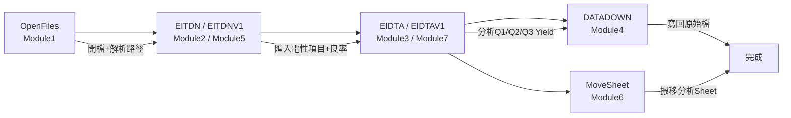
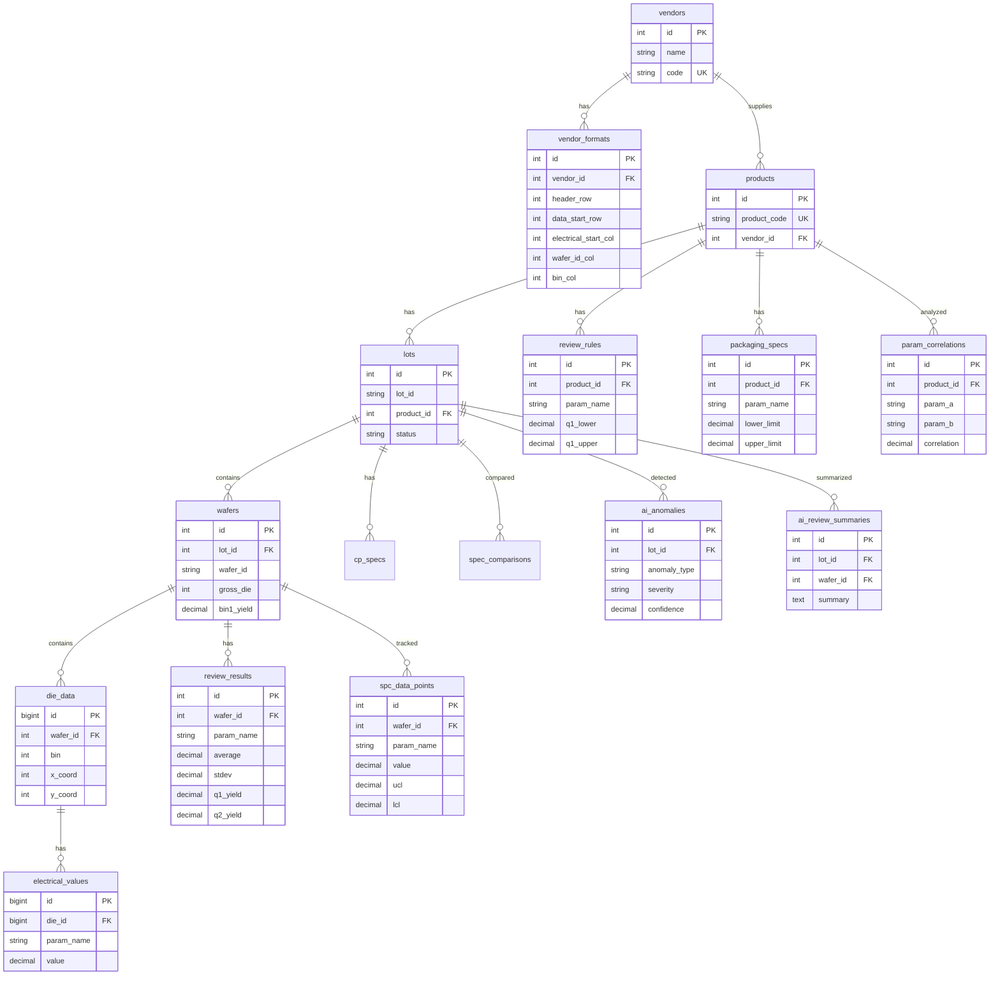
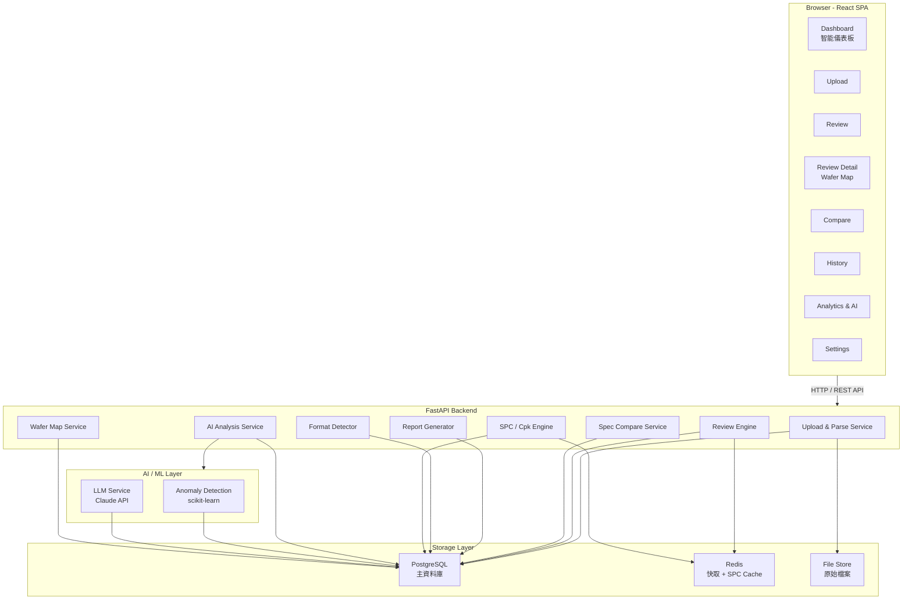
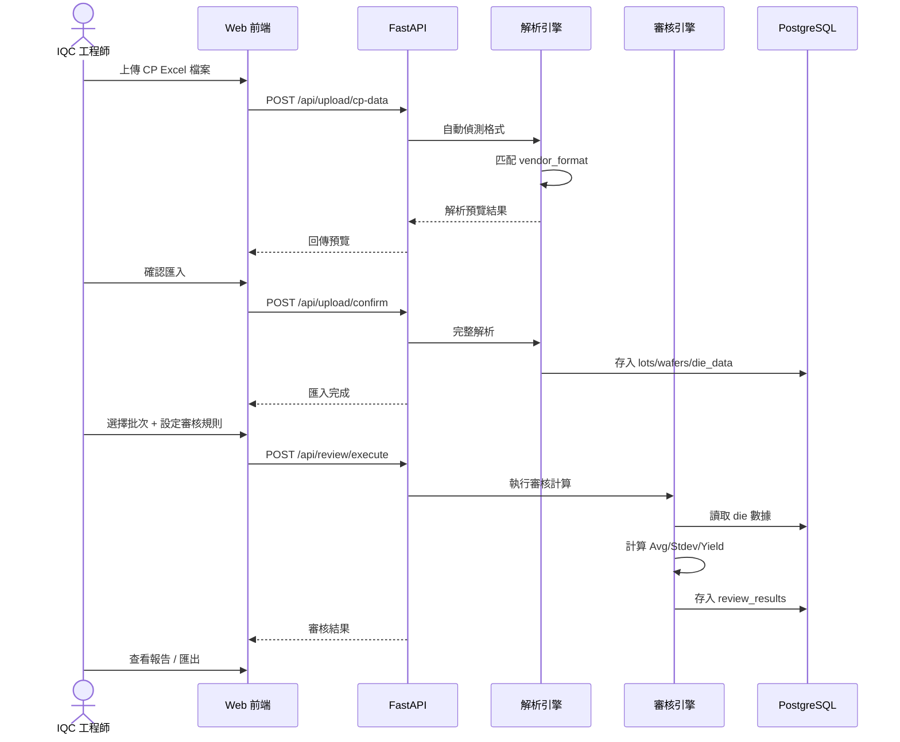

# IQC 晶圓 CP 數據審核系統 — 技術需求規格書

**版本**: v2.0
**日期**: 2026-03-12
**文件類型**: 工程師版（內部）

---

## 1. 系統概述

### 1.1 目標
取代現有 Excel VBA 手動審核流程，建立 Web-based 的晶圓 CP 數據自動化審核平台。

### 1.2 現有流程分析（VBA 逆向工程）

現有的 Excel VBA 工具有以下模組和對應邏輯：




#### VBA 模組對照表

| VBA Module | 函數名 | 功能 | 對應系統功能 |
|-----------|--------|------|-------------|
| Module1 | `OpenFiles()` | 開檔對話框，解析路徑/檔名/批號 | 數據上傳模組 |
| Module2 | `EITDN()` | 匯入電性項目 + 計算良率（固定die數） | CP 解析引擎 |
| Module5 | `EITDNV1()` | 同上，非固定 die 數版本 | CP 解析引擎（通用版） |
| Module3 | `EIDTA()` | 分析各電性 Q1/Q2/Q3 Yield（固定die數） | 審核計算引擎 |
| Module7 | `EIDTAV1()` | 同上，非固定 die 數版本 | 審核計算引擎（通用版） |
| Module4 | `DATADOWN()` | 將 TotalList 寫回原始檔 | 報表匯出 |
| Module6 | `MoveSheet()` | 將分析 Sheet 搬到原始檔 | 報表匯出 |

#### VBA 核心計算邏輯（需完整重現）

```
對每個審查電性項目 (最多10個):
  對每片 Wafer (最多25片):
    1. 從原始 data 中篩選 Bin=1 (良品) 的數據
    2. 計算統計值:
       - Average = AVERAGE(Bin1_data)
       - STDEV   = STDEV(Bin1_data)
       - Max     = MAX(Bin1_data)
       - Min     = MIN(Bin1_data)
    3. 計算良率:
       - CP Bin1 Yield = COUNT(Bin1_data) / Total_die_count
       - Q1 Yield = COUNTIFS(data, ">" & Q1_Lower, data, "<" & Q1_Upper) / die_count
       - Q2 Yield = COUNTIFS(data, ">" & Q2_Lower, data, "<" & Q2_Upper) / die_count
       - Q3 Yield = COUNTIFS(data, ">" & Q3_Lower, data, "<" & Q3_Upper) / die_count
```

---

## 2. 數據模型

### 2.1 CP 原始數據格式分析

已知兩種廠家格式：

#### 格式 A：捷捷微 (JJW) — 如 JI30050A
```
data sheet 結構:
  Row 1-7: 測試參數元資料 (TEST NUMBER, LOWER/UPPER LIMIT, UNIT, BIAS)
  Row 8:   欄位標題行
  Row 9+:  逐 die 測試數據

欄位:
  A=ProductID, B=LotID, C=Mark LotID, D=WaferID,
  E=Test Program, F=CP_STEP, G=WS_SITE_ID, H=START_TIME,
  I=Prober_Card, J=EPQName, K=SITE NO, L=BIN,
  M=XCoord, N=YCoord,
  O-AK=電性測試值 (23個電性項目)

特點:
  - 電性項目起始欄: O (第15欄)
  - LOWER LIMIT 在 Row 2, UPPER LIMIT 在 Row 3
  - WaferID 在 D 欄 (第4欄)
  - BIN 在 L 欄 (第12欄)
  - 含額外 sheets: statistic, PAT summary, Average
  - 每片 wafer die 數不固定（由 WaferID 分組）
```

#### 格式 B：祥瑞微 (XRW) — 如 4746
```
data sheet 結構:
  Row 1-4: 測試參數元資料 (TEST NUMBER, LOWER/UPPER LIMIT, UNITS)
  Row 5:   欄位標題行
  Row 6+:  逐 die 測試數據

欄位:
  A=ProductID, B=LotID, C=Mark LotID, D=WaferID,
  E=Test Program, F=CP_STEP, G=WS_SITE_ID, H=START_TIME,
  I=BIN, J=XCoord, K=YCoord,
  L-AD=電性測試值 (19個電性項目)

特點:
  - 電性項目起始欄: L (第12欄)
  - LOWER LIMIT 在 Row 2, UPPER LIMIT 在 Row 3
  - WaferID 在 D 欄 (第4欄)
  - BIN 在 I 欄 (第9欄)
  - 每片 wafer 固定 208 die
```

### 2.2 資料庫 Schema



#### vendors（晶圓廠商）
```sql
CREATE TABLE vendors (
  id            SERIAL PRIMARY KEY,
  name          VARCHAR(100) NOT NULL,       -- 廠家名稱，如 "捷捷微", "祥瑞微"
  code          VARCHAR(20) UNIQUE NOT NULL,  -- 廠家代碼，如 "JJW", "XRW"
  created_at    TIMESTAMP DEFAULT NOW()
);
```

#### vendor_formats（廠家數據格式模板）
```sql
CREATE TABLE vendor_formats (
  id                    SERIAL PRIMARY KEY,
  vendor_id             INT REFERENCES vendors(id),
  format_name           VARCHAR(100),
  header_row            INT NOT NULL,          -- 欄位標題行號
  data_start_row        INT NOT NULL,          -- 數據起始行號
  lower_limit_row       INT NOT NULL,          -- LOWER LIMIT 行號
  upper_limit_row       INT NOT NULL,          -- UPPER LIMIT 行號
  electrical_start_col  INT NOT NULL,          -- 電性項目起始欄號
  wafer_id_col          INT NOT NULL,          -- WaferID 欄號
  bin_col               INT NOT NULL,          -- BIN 欄號
  product_id_col        INT,                   -- ProductID 欄號
  lot_id_col            INT,                   -- LotID 欄號
  fixed_die_count       INT,                   -- 固定 die 數（NULL=非固定）
  created_at            TIMESTAMP DEFAULT NOW(),
  updated_at            TIMESTAMP DEFAULT NOW()
);
```

#### products（產品）
```sql
CREATE TABLE products (
  id            SERIAL PRIMARY KEY,
  product_code  VARCHAR(50) UNIQUE NOT NULL,  -- 如 "JI30050A", "4746"
  vendor_id     INT REFERENCES vendors(id),
  description   TEXT,
  created_at    TIMESTAMP DEFAULT NOW()
);
```

#### lots（批次）
```sql
CREATE TABLE lots (
  id            SERIAL PRIMARY KEY,
  lot_id        VARCHAR(50) NOT NULL,         -- 如 "PD03414", "AME216"
  mark_lot_id   VARCHAR(50),
  product_id    INT REFERENCES products(id),
  test_program  VARCHAR(100),
  upload_time   TIMESTAMP DEFAULT NOW(),
  file_name     VARCHAR(255),
  status        VARCHAR(20) DEFAULT 'pending' -- pending/reviewed/approved/rejected
);
```

#### wafers（晶圓片）
```sql
CREATE TABLE wafers (
  id            SERIAL PRIMARY KEY,
  lot_id        INT REFERENCES lots(id),
  wafer_id      VARCHAR(20) NOT NULL,         -- 片號如 "01", "02"
  gross_die     INT,                          -- 總 die 數
  bin1_count    INT,                          -- Bin1 良品數
  bin1_yield    DECIMAL(6,4),                 -- Bin1 良率
  cp_step       VARCHAR(20),
  start_time    TIMESTAMP,
  UNIQUE(lot_id, wafer_id)
);
```

#### die_data（逐 die 測試數據）
```sql
CREATE TABLE die_data (
  id            BIGSERIAL PRIMARY KEY,
  wafer_id      INT REFERENCES wafers(id),
  site_no       INT,
  bin           INT NOT NULL,
  x_coord       INT,
  y_coord       INT
);
```

#### electrical_values（電性測試值 — EAV 模型）
```sql
CREATE TABLE electrical_values (
  id            BIGSERIAL PRIMARY KEY,
  die_id        BIGINT REFERENCES die_data(id),
  param_name    VARCHAR(50) NOT NULL,          -- 如 "VTH1_250uA", "RDS1_10V"
  value         DECIMAL(15,6),
  INDEX idx_die_param (die_id, param_name)
);
```

*備註: 對於大量數據考慮使用寬表（每個電性項目一個欄位）替代 EAV 以提升查詢效能。*

#### cp_specs（CP 測試規格）
```sql
CREATE TABLE cp_specs (
  id            SERIAL PRIMARY KEY,
  lot_id        INT REFERENCES lots(id),
  param_name    VARCHAR(50) NOT NULL,
  lower_limit   DECIMAL(15,6),
  upper_limit   DECIMAL(15,6),
  unit          VARCHAR(20),
  bias_info     TEXT                           -- 測試條件描述
);
```

#### review_rules（審核規則 — Q1/Q2/Q3）
```sql
CREATE TABLE review_rules (
  id            SERIAL PRIMARY KEY,
  product_id    INT REFERENCES products(id),
  param_name    VARCHAR(50) NOT NULL,
  q1_lower      DECIMAL(15,6),
  q1_upper      DECIMAL(15,6),
  q2_lower      DECIMAL(15,6),
  q2_upper      DECIMAL(15,6),
  q3_lower      DECIMAL(15,6),
  q3_upper      DECIMAL(15,6),
  created_by    INT,
  created_at    TIMESTAMP DEFAULT NOW()
);
```

#### review_results（審核結果）
```sql
CREATE TABLE review_results (
  id            SERIAL PRIMARY KEY,
  wafer_id      INT REFERENCES wafers(id),
  param_name    VARCHAR(50) NOT NULL,
  average       DECIMAL(15,6),
  stdev         DECIMAL(15,6),
  max_val       DECIMAL(15,6),
  min_val       DECIMAL(15,6),
  bin1_yield    DECIMAL(6,4),
  q1_yield      DECIMAL(6,4),
  q2_yield      DECIMAL(6,4),
  q3_yield      DECIMAL(6,4),
  reviewed_at   TIMESTAMP DEFAULT NOW()
);
```

#### packaging_specs（封裝測試規格）
```sql
CREATE TABLE packaging_specs (
  id            SERIAL PRIMARY KEY,
  product_id    INT REFERENCES products(id),
  param_name    VARCHAR(50) NOT NULL,
  lower_limit   DECIMAL(15,6),
  upper_limit   DECIMAL(15,6),
  unit          VARCHAR(20),
  test_condition TEXT,
  created_at    TIMESTAMP DEFAULT NOW()
);
```

#### spec_comparisons（規格對比結果）
```sql
CREATE TABLE spec_comparisons (
  id                 SERIAL PRIMARY KEY,
  lot_id             INT REFERENCES lots(id),
  cp_param_name      VARCHAR(50),
  pkg_param_name     VARCHAR(50),
  cp_lower           DECIMAL(15,6),
  cp_upper           DECIMAL(15,6),
  pkg_lower          DECIMAL(15,6),
  pkg_upper          DECIMAL(15,6),
  internal_lower     DECIMAL(15,6),    -- 內部加嚴規格
  internal_upper     DECIMAL(15,6),
  is_compliant       BOOLEAN,
  compliance_note    TEXT,
  compared_at        TIMESTAMP DEFAULT NOW()
);
```

#### spc_data_points（SPC 管制資料點）
```sql
CREATE TABLE spc_data_points (
  id            SERIAL PRIMARY KEY,
  wafer_id      INT REFERENCES wafers(id),
  param_name    VARCHAR(50) NOT NULL,
  value         DECIMAL(15,6),             -- X-bar 值
  range_value   DECIMAL(15,6),             -- R 值
  ucl           DECIMAL(15,6),             -- 管制上限
  lcl           DECIMAL(15,6),             -- 管制下限
  mean          DECIMAL(15,6),             -- 中心線
  sigma_2_upper DECIMAL(15,6),             -- +2σ
  sigma_2_lower DECIMAL(15,6),             -- -2σ
  is_ooc        BOOLEAN DEFAULT FALSE,     -- Out-of-Control 標記
  recorded_at   TIMESTAMP DEFAULT NOW()
);
```

#### cpk_results（製程能力指標）
```sql
CREATE TABLE cpk_results (
  id            SERIAL PRIMARY KEY,
  lot_id        INT REFERENCES lots(id),
  param_name    VARCHAR(50) NOT NULL,
  cp            DECIMAL(6,3),              -- 製程能力 Cp
  cpk           DECIMAL(6,3),              -- 製程能力指數 Cpk
  mean          DECIMAL(15,6),
  stdev         DECIMAL(15,6),
  usl           DECIMAL(15,6),             -- 規格上限
  lsl           DECIMAL(15,6),             -- 規格下限
  calculated_at TIMESTAMP DEFAULT NOW()
);
```

#### ai_anomalies（AI 異常偵測結果）
```sql
CREATE TABLE ai_anomalies (
  id            SERIAL PRIMARY KEY,
  lot_id        INT REFERENCES lots(id),
  wafer_id      INT REFERENCES wafers(id), -- 可為 NULL（批次層級異常）
  anomaly_type  VARCHAR(50) NOT NULL,      -- 'drift', 'edge_loss', 'cluster', 'shift'
  severity      VARCHAR(20) NOT NULL,      -- 'info', 'warning', 'danger'
  confidence    DECIMAL(5,2),              -- 信心度 0-100%
  param_name    VARCHAR(50),               -- 相關參數
  description   TEXT,                       -- 異常描述
  suggestion    TEXT,                       -- AI 建議處理方式
  is_resolved   BOOLEAN DEFAULT FALSE,
  detected_at   TIMESTAMP DEFAULT NOW()
);
```

#### ai_review_summaries（AI 審查摘要）
```sql
CREATE TABLE ai_review_summaries (
  id            SERIAL PRIMARY KEY,
  lot_id        INT REFERENCES lots(id),
  wafer_id      INT REFERENCES wafers(id), -- 可為 NULL（批次層級摘要）
  summary       TEXT NOT NULL,              -- AI 生成的自然語言摘要
  key_findings  JSONB,                      -- 結構化關鍵發現
  risk_level    VARCHAR(20),               -- 'low', 'medium', 'high'
  model_version VARCHAR(20),               -- AI 模型版本
  generated_at  TIMESTAMP DEFAULT NOW()
);
```

#### param_correlations（參數相關性分析）
```sql
CREATE TABLE param_correlations (
  id            SERIAL PRIMARY KEY,
  product_id    INT REFERENCES products(id),
  param_a       VARCHAR(50) NOT NULL,
  param_b       VARCHAR(50) NOT NULL,
  correlation   DECIMAL(5,4),              -- Pearson 相關係數 -1 ~ 1
  sample_size   INT,
  p_value       DECIMAL(10,8),             -- 統計顯著性
  calculated_at TIMESTAMP DEFAULT NOW(),
  UNIQUE(product_id, param_a, param_b)
);
```

#### vendor_scores（廠商績效評分）
```sql
CREATE TABLE vendor_scores (
  id            SERIAL PRIMARY KEY,
  vendor_id     INT REFERENCES vendors(id),
  period        VARCHAR(7) NOT NULL,        -- 'YYYY-MM' 月度評分
  avg_yield     DECIMAL(6,4),
  lot_count     INT,
  anomaly_count INT,
  cpk_avg       DECIMAL(6,3),
  score         DECIMAL(5,2),               -- 綜合評分 0-100
  rank          INT,
  calculated_at TIMESTAMP DEFAULT NOW(),
  UNIQUE(vendor_id, period)
);
```

---

## 3. API 設計

### 3.1 數據上傳與解析

```
POST   /api/upload/cp-data
       - multipart/form-data，上傳 CP Excel 檔案
       - 回傳: 自動識別的格式 + 解析預覽

POST   /api/upload/confirm
       - 確認匯入，觸發完整解析 + 入庫

GET    /api/vendors
       - 取得所有廠家列表

POST   /api/vendors/{id}/formats
       - 新增/更新廠家數據格式模板
```

### 3.2 審核

```
POST   /api/review/execute
       - Body: { lot_id, params: ["VTH1", "RDS1"], rules: {...} }
       - 執行審核計算

GET    /api/review/results/{lot_id}
       - 取得審核結果

GET    /api/review/results/{lot_id}/wafer/{wafer_id}
       - 取得特定 Wafer 的詳細審核結果
```

### 3.3 規格對比

```
POST   /api/specs/packaging
       - 上傳封裝測試規格

POST   /api/specs/compare
       - Body: { lot_id, cp_params: [...], pkg_params: [...], rules: {...} }
       - 執行 CP vs 封裝規格對比

GET    /api/specs/compare/{comparison_id}
       - 取得對比結果
```

### 3.4 數據查詢

```
GET    /api/lots?vendor=JJW&product=JI30050A&from=2025-01-01&to=2025-12-31
       - 批次查詢

GET    /api/trends/{product_id}/{param_name}?from=...&to=...
       - 歷史趨勢數據

GET    /api/dashboard/summary
       - 儀表板概覽數據（KPI、趨勢、廠商排名、AI 警示）
```

### 3.5 進階分析 & SPC

```
GET    /api/analytics/spc/{product_id}/{param_name}?from=...&to=...
       - SPC 管制圖數據（含 UCL/LCL/Mean/±2σ）

GET    /api/analytics/cpk/{lot_id}
       - 該批次所有參數的 Cp/Cpk 指標

GET    /api/analytics/distribution/{lot_id}/{param_name}
       - 參數分佈直方圖數據（含 Mean/Stdev/Cpk）

GET    /api/analytics/correlation/{product_id}
       - 參數間相關性矩陣（Pearson 相關係數）

GET    /api/analytics/yield-trend?vendor=...&from=...&to=...
       - 各廠商良率月度趨勢
```

### 3.6 AI 智能分析

```
POST   /api/ai/anomaly-detect
       - Body: { lot_id, params: [...] }
       - 執行 AI 異常偵測，回傳異常列表 + 信心度

GET    /api/ai/anomalies?severity=danger&resolved=false
       - 查詢 AI 偵測到的異常（支持篩選）

POST   /api/ai/review-summary
       - Body: { lot_id, wafer_id? }
       - AI 生成自然語言審查摘要

GET    /api/ai/review-summary/{lot_id}/{wafer_id}
       - 取得已生成的 AI 審查摘要

PATCH  /api/ai/anomalies/{id}/resolve
       - 標記異常為已處理

GET    /api/ai/insights/dashboard
       - 儀表板 AI 洞察摘要（最新異常 + 建議 + 風險等級）
```

### 3.7 廠商績效

```
GET    /api/vendors/scores?period=2026-03
       - 取得廠商月度績效排名

GET    /api/vendors/{id}/performance?from=...&to=...
       - 特定廠商的績效趨勢

GET    /api/vendors/ranking
       - 廠商排名一覽（依平均良率）
```

### 3.8 Wafer Map

```
GET    /api/wafer-map/{wafer_id}
       - 取得 Wafer Die Map 數據（座標 + Bin 結果）

GET    /api/wafer-map/{wafer_id}/statistics
       - Wafer 統計數據（Total/Pass/Yield/Fail）

GET    /api/wafer-map/{wafer_id}/bin-distribution
       - Bin 分佈統計
```

---

## 4. 核心演算法

### 4.1 CP 數據解析流程

```python
def parse_cp_file(file, vendor_format):
    """
    1. 讀取 Excel 的 data sheet
    2. 根據 vendor_format 定位:
       - header_row → 取得所有電性項目名稱
       - lower_limit_row / upper_limit_row → 取得 CP 規格
       - data_start_row → 數據起始行
    3. 逐行讀取 die 數據:
       - 按 wafer_id_col 分組
       - 讀取 bin_col 判斷 Bin 類別
       - 讀取 electrical_start_col 到最後一個非空欄的電性值
    4. 如果 fixed_die_count 為 NULL:
       - 動態偵測 WaferID 變化來分片
       - 統計每片實際 die 數
    5. 回傳結構化數據
    """
```

### 4.2 審核計算流程

```python
def calculate_review(wafer_data, params, rules):
    """
    對每個 wafer:
      對每個要審查的 param:
        1. 篩選 bin == 1 的數據
        2. 取出該 param 的所有值 → values[]
        3. 計算:
           - average = mean(values)
           - stdev = std(values)
           - max_val = max(values)
           - min_val = min(values)
           - bin1_yield = len(values) / total_die_count
        4. 對 Q1/Q2/Q3 規格:
           - q_yield = count(v for v in values if q_lower < v < q_upper) / total_die
           注意: 使用嚴格不等式 (> 和 <)，與原 VBA CountIfs 行為一致
    """
```

### 4.3 格式自動識別（未來擴展）

```python
def auto_detect_format(file):
    """
    啟發式偵測策略:
    1. 掃描前 20 行，尋找關鍵字:
       - "TEST NUMBER", "LOWER LIMIT", "UPPER LIMIT" → 找到元資料行
       - "ProductID", "LotID", "WaferID", "BIN" → 找到標題行
    2. 根據欄位位置匹配已知 vendor_format
    3. 如果無法匹配，提示用戶手動配置
    """
```

### 4.4 SPC 管制圖計算

```python
def calculate_spc(param_values_by_wafer, spec_limits):
    """
    X-bar 管制圖計算:
    1. 對每片 Wafer 計算該參數的 X-bar (平均值)
    2. 計算所有 X-bar 的 Grand Mean (X̿)
    3. 計算管制界限:
       - UCL = X̿ + 3σ    (管制上限)
       - LCL = X̿ - 3σ    (管制下限)
       - +2σ = X̿ + 2σ    (警戒上限)
       - -2σ = X̿ - 2σ    (警戒下限)
    4. 判定 Out-of-Control:
       - 超出 UCL/LCL
       - 連續 7 點同側 (Run rule)
       - 連續 6 點遞增/遞減 (Trend rule)
    """
```

### 4.5 Cp/Cpk 製程能力指數計算

```python
def calculate_cpk(values, usl, lsl):
    """
    Cp  = (USL - LSL) / (6σ)         -- 製程能力
    Cpk = min(CPU, CPL)               -- 製程能力指數
    CPU = (USL - X̄) / (3σ)
    CPL = (X̄ - LSL) / (3σ)

    判讀標準:
      Cpk >= 1.67  → 優良
      Cpk >= 1.33  → 良好
      Cpk >= 1.00  → 尚可
      Cpk <  1.00  → 不足，需改善
    """
```

### 4.6 AI 異常偵測

```python
def detect_anomalies(historical_data, current_lot):
    """
    異常偵測模型 (scikit-learn):
    1. 特徵工程:
       - 良率趨勢斜率 (yield drift)
       - 邊緣 Die Fail 比率 (edge loss ratio)
       - 參數 Stdev 變化率
       - Bin 分佈偏離度
    2. 偵測類型:
       - 'drift'      → 參數漸進偏移（Isolation Forest）
       - 'edge_loss'  → 邊緣良率異常（空間分析）
       - 'cluster'    → 集中性不良（DBSCAN 聚類）
       - 'shift'      → 突然偏移（CUSUM 累積和）
    3. 輸出: anomaly_type, severity, confidence, description
    """
```

### 4.7 AI 審查摘要生成

```python
def generate_review_summary(wafer_data, review_results, anomalies):
    """
    使用 LLM (Claude API) 生成自然語言審查摘要:
    1. 構建 Prompt:
       - 輸入: Wafer 統計數據、電性參數、Bin 分佈、異常偵測結果
       - 指示: 以 IQC 工程師角度，摘要關鍵發現與建議
    2. 輸出範例:
       "W01 Bin1 良率 99.51%，整體表現良好。VTH 平均值 -0.72V 位於
        規格中心，分佈穩定 (σ=0.03V)。邊緣區域偵測到 1 顆 Bin2 不良，
        位於 (12,7)，建議觀察後續批次同位置趨勢。"
    """
```

### 4.8 Wafer Map 渲染

```python
def generate_wafer_map(die_data, wafer_diameter=200):
    """
    Wafer Map 數據準備:
    1. 從 die_data 取出所有 (x_coord, y_coord, bin) 記錄
    2. 計算晶圓中心: cx = (max_x + min_x) / 2, cy = (max_y + min_y) / 2
    3. 計算半徑: r = max(max_x - min_x, max_y - min_y) / 2
    4. 篩選圓內 Die: (x - cx)² + (y - cy)² <= r²
    5. 著色規則:
       - Bin 1 → 綠色 (Pass)
       - Bin 2+ → 紅色/橙色 (Fail，按 Bin 類型分色)
       - 無數據 → 灰色
    6. 前端使用 Canvas/SVG 渲染:
       - 每個 Die 為一個方塊
       - 圓形裁切遮罩
       - 支持 Hover 顯示 Die 詳細資訊
    """
```

### 4.9 參數相關性分析

```python
def calculate_correlations(product_id, params):
    """
    Pearson 相關係數矩陣:
    1. 從歷史數據取出所有 Bin1 良品的電性值
    2. 對 N 個參數建立 N×N 相關矩陣
    3. 計算 correlation(param_a, param_b) 與 p-value
    4. 標記顯著相關 (|r| > 0.7 且 p < 0.05) 的參數對
    5. 用途: 發現隱藏的製程關聯，輔助根因分析
    """
```

---

## 5. 技術架構

### 5.1 技術選型建議

| 層級 | 技術 | 備註 |
|------|------|------|
| 前端 | React + TypeScript + Ant Design | 企業級 UI 組件 |
| 圖表 | ECharts / Recharts | 趨勢圖 + Wafer Map + SPC 管制圖 |
| Wafer Map | D3.js / Custom Canvas | 高效能 Die-level 渲染 |
| 後端 | Python FastAPI | 數據處理能力強 |
| 數據處理 | Pandas + NumPy + SciPy | Excel 解析 + 統計計算 + SPC/Cpk |
| AI / ML | scikit-learn + Claude API | 異常偵測模型 + AI 審查摘要生成 |
| 資料庫 | PostgreSQL | 支持大量數據 + JSON 欄位 |
| 快取 | Redis | SPC 計算快取 + 即時 Dashboard |
| 檔案存儲 | 本地/MinIO | 原始 CP 檔案存檔 |

### 5.2 系統架構圖



### 5.3 數據處理流程



---

## 6. 頁面規劃

| 頁面 | 路由 | 功能 |
|------|------|------|
| 登入 | /login | 用戶認證（帳號密碼 + SSO） |
| 智能儀表板 | /dashboard | KPI 監控、良率趨勢圖、廠商排名、AI 警示、Cpk 概覽、活動流 |
| 數據上傳 | /upload | 上傳 CP 數據、格式預覽、確認匯入 |
| 審核報告 | /review | 選擇批次、執行審核、查看結果 |
| 審核詳情 | /review/:lotId/wafer/:waferId | Wafer Map、電性參數表、Bin 分佈、AI 審查摘要 |
| 規格對比 | /compare | 封裝測規 vs CP 規格對比（Match/Tighter/Out of Range） |
| 歷史查詢 | /history | 多條件查詢、趨勢分析圖表 |
| 進階分析 | /analytics | SPC 管制圖、分佈直方圖、AI 異常偵測、參數相關矩陣 |
| 廠家管理 | /settings/vendors | 新增/編輯廠家 + 格式模板 |
| 規則管理 | /settings/rules | 管理 Q1/Q2/Q3 審核規則 |
| 測規管理 | /settings/specs | 管理封裝測試規格 |

---

## 7. 注意事項

### 7.1 數據量評估
- 每批次 ≈ 25 片 Wafer × 208 die × 20 電性項目 = ~104,000 筆電性數據
- 每月預估 50 批 → ~5,200,000 筆/月
- 建議使用寬表 + 分區表策略

### 7.2 VBA 相容性注意
- VBA `CountIfs` 使用的是嚴格不等式（`>` 和 `<`，不含等號）
- VBA `STDEV` 對應 sample standard deviation（n-1）
- 需確保新系統計算結果與現有 VBA 一致，方便驗證

### 7.3 格式擴展設計
- vendor_formats 表的設計允許動態新增格式
- 未來可加入 CSV、其他 ERP 導出格式的支持
- 考慮支持「格式模板試算」功能，讓用戶上傳新格式後可預覽解析結果

---

*本文件包含內部技術細節與現有系統逆向工程資訊，僅供開發團隊使用。*
